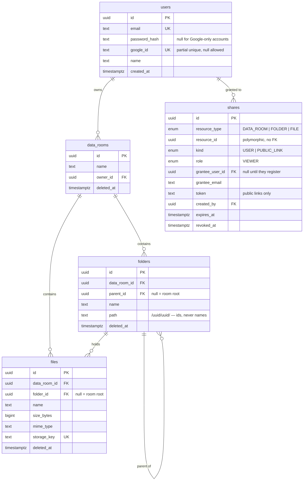

> English · [Українська](README.uk.md)

# Data Room API

Backend for a virtual data room: nested folders, direct-to-storage file uploads, and read-only
sharing of a room, a folder or a single file — by public link or to a named user.

**Stack:** NestJS 11 · TypeScript · PostgreSQL 17 (Supabase) · TypeORM 0.3 (migrations only,
`synchronize: false`) · Supabase Storage · JWT + Google OAuth 2.0

---

## Live

| | URL |
|---|---|
| API | `[<railway-url>](https://foldersbe-production.up.railway.app/)` |
| Swagger | `[<railway-url>/api/docs](https://foldersbe-production.up.railway.app/api/docs)` |
| Frontend | `<vercel-url>` |

---

## Setup

Requires Node 20+, a PostgreSQL database and a Supabase Storage bucket.

```bash
git clone git@github.com:Zetonen/foldersBE.git
cd foldersBE
npm ci
cp .env.example .env      # fill it in, see below
npm run migration:run     # creates the whole schema
npm run seed              # optional: demo users, tree and shares
npm run start:dev         # http://localhost:3001, docs at /api/docs
```

`.env.example` documents every variable inline. The ones without a default:

| Variable | Notes |
|---|---|
| `DATABASE_URL` | Runtime connection. Supabase **transaction pooler, port 6543**. Prepared statements are disabled for it. |
| `DIRECT_URL` | Migrations only. **Port 5432** (session mode) — the transaction pooler cannot run DDL reliably. |
| `JWT_ACCESS_SECRET`, `JWT_REFRESH_SECRET` | Two independent secrets, 32+ chars each. |
| `SUPABASE_URL`, `SUPABASE_SERVICE_ROLE_KEY`, `SUPABASE_STORAGE_BUCKET` | Bucket must be **private**. The service-role key is backend-only. |
| `FRONTEND_URL` | CORS origin. Comma-separated list allowed; the first entry is also the default Google redirect base. |
| `GOOGLE_CLIENT_ID`, `GOOGLE_CLIENT_SECRET` | Optional. Left empty, `GET /auth/google` answers **503** and everything else keeps working. |

The app validates its whole environment at boot (`src/config/env.validation.ts`) and refuses to
start on a bad config rather than failing on the first request.

### Scripts

```bash
npm run start:dev        # watch mode
npm run build            # nest build
npm test                 # 35 unit tests
npm run lint             # eslint, type-aware
npm run format           # prettier
npm run migration:run    # apply migrations
npm run migration:revert # roll the last one back
npm run seed             # demo data: 2 users, a small tree, 3 kinds of share
npm run seed:test-room   # a 1000-file room for pagination testing
```

`npm run seed` prints the credentials it creates. Both seeds are idempotent — re-running them
adds nothing and destroys nothing.

---

## Data model



Five tables, one row per client in each — tenant isolation is the `data_room_id` column, and no
query against `folders` or `files` runs without it.

---

## Design decisions

### The tree is an adjacency list *and* a materialized path

`folders.parent_id` is the source of truth. `folders.path` is a denormalized `/uuid1/uuid2/`
string that always contains ids, never names — so renaming a folder never touches a path.

Keeping both is what makes the expensive operations cheap:

| Operation | With path | With parent_id alone |
|---|---|---|
| Whole subtree | `path LIKE '/a/b/%'`, one index scan | recursive CTE |
| Delete a branch | one `UPDATE … WHERE path LIKE` | recursive CTE, then update |
| Breadcrumbs | split the string, one `WHERE id = ANY(...)` | one query per level |
| Ancestor list for access checks | split the string, zero queries | recursive CTE per request |

`idx_folders_path_pattern` uses `text_pattern_ops`, without which a `LIKE 'prefix%'` predicate
cannot use a btree index under a non-C collation.

Moving a folder rewrites the path of the entire subtree with a single prefix-replacing `UPDATE`,
after rejecting cycles (`isDescendantOrSelf`) and re-checking the depth limit of 20 levels for the
*deepest* node being moved, not just the folder itself.

Files have no path — only `folder_id`. A file's path is its folder's path, and duplicating it
would mean rewriting every file row on every folder move.

### Authorization lives in exactly one place

A share is stored **only on the node where it was granted** and is never copied downward.
Resolution walks upward instead: `path` is split into an array of ancestor ids, and a single query
looks for shares on any of them.

```
ResourceAccessGuard  →  AccessResolverService  →  AccessRepository
   (routes, roles)        (owner? shares? role)     (SQL)
```

Rules the resolver enforces:

- The resource owner always wins, without touching the `shares` table.
- The effective role is `MAX(role)` over every share found on the ancestor chain.
- A public token grants access to **its own node and its subtree only**. The guard re-resolves the
  token against the requested node's ancestors, so asking for a sibling folder returns 404. Without
  that check the token would be an IDOR.
- Breadcrumbs are trimmed at the share root (`boundaryId`), so a recipient never learns the names
  of folders above what was shared with them.

There is not a single permission `if` in a controller. Endpoints declare intent:

```ts
@ResourceTarget({ type: ShareResourceType.Folder, from: 'params', key: 'id' })
@RequireRole(Role.Owner)
```

**404 vs 403:** 404 when the caller has no access at all — an attacker must not be able to probe
which ids exist. 403 only when access exists but the role is too low. 409 for name conflicts.
Expected situations never produce a 500.

### Files never pass through Node

Upload is a three-step handshake:

1. `POST /files/upload-url` — validates the folder, size and MIME type, resolves the final name
   against existing siblings, returns a signed upload URL plus a `storageKey`.
2. The browser `PUT`s the bytes straight to Supabase Storage.
3. `POST /files/confirm` — verifies the object really exists and its byte size matches what was
   promised, then inserts the row.

The API server never buffers a file, so a 100 MB upload costs it nothing but two small requests,
and progress reporting is a native browser concern. Downloads mirror this: a signed URL with a
15-minute TTL, minted on demand, never stored.

Step 2 can fail after step 1 hands out a key. That leaves an unreferenced object in the bucket,
never a phantom row — the DB only learns about a file once the bytes are verifiably there.

### Name conflicts resolve, they don't fail

Uploading `audit.pdf` into a folder that already has one produces `audit (1).pdf`; the next one
`audit (2).pdf`. The suffix goes before the extension, and the search for a free number ignores
suffixes belonging to a different extension. Folders use the same helper with extension splitting
turned off.

One implementation (`NameConflictService`) is shared by upload, rename and move, so the three
cannot drift apart. The database enforces the invariant regardless with partial unique indexes
`(folder_id, name) WHERE deleted_at IS NULL`; a race that slips past the check surfaces as 409, not
as a duplicate row.

Postgres does not treat `NULL`s as equal in a unique index, so room-root items (`folder_id IS NULL`)
need their own partial indexes — without `uq_files_room_root_name` you could create two identically
named files in the root.

### Everything is soft-deleted

`deleted_at` on rooms, folders and files; every read filters `deleted_at IS NULL`. Deleting a
folder stamps its whole subtree in two `UPDATE`s driven by `path LIKE`.

Before the confirmation dialog, the frontend calls `GET /folders/:id/stats`, which returns both
how much sits *directly* in the folder and how much is in the entire branch — so the warning can
say "80 files in 2 folders, 1.2 MB will be deleted" rather than a number the user cannot verify.

If a recipient is viewing a folder at the moment it is deleted, their next request 404s through the
same code path as any missing resource — nothing special-cased.

### Auth

Access token (15 min) in the response body, refresh token (7 days) in an `httpOnly` cookie scoped
to `/auth`. Rotating on refresh. `/auth/login` and `/auth/register` are rate limited per IP.

Google sign-in uses the authorization-code flow with a **frontend-hosted** callback page — the
backend never redirects a browser, it only mints a consent URL and later exchanges the code. CSRF
protection is a signed, 10-minute JWT `state` with a random nonce, which keeps the server
stateless. The returned `id_token` is validated (`iss`, `aud`, `exp`, `email_verified`).

Account linking matches on Google account id first, then on **verified** email. An unverified email
is rejected outright — accepting it would let anyone who creates a Google account with someone
else's unverified address take over their data room.

---

## API

32 operations, all documented in Swagger at `/api/docs`.

| Method | Path | Notes |
|---|---|---|
| `POST` | `/auth/register`, `/auth/login` | rate limited |
| `GET` | `/auth/google` | consent URL; 503 if not configured |
| `POST` | `/auth/google/callback` | code + state → tokens |
| `POST` | `/auth/refresh`, `/auth/logout` | refresh cookie |
| `GET` | `/auth/me` | |
| `POST`/`GET`/`PATCH`/`DELETE` | `/data-rooms`, `/data-rooms/:id` | |
| `GET` | `/data-rooms/:id/root` | root listing, paginated |
| `POST` | `/folders` | |
| `GET` | `/folders/:id/children` | paginated |
| `GET` | `/folders/:id/stats` | direct + subtree counters |
| `PATCH`/`POST`/`DELETE` | `/folders/:id`, `/folders/:id/move`, `/folders/:id` | rename, move, delete branch |
| `POST` | `/files/upload-url`, `/files/confirm` | |
| `GET` | `/files/:id`, `/files/:id/download-url` | |
| `PATCH`/`POST`/`DELETE` | `/files/:id`, `/files/:id/move`, `/files/:id` | |
| `POST`/`GET`/`DELETE` | `/shares`, `/shares?resourceType=…`, `/shares/:id` | create, list, revoke |
| `GET` | `/shared-with-me` | what others shared with me |
| `GET` | `/share/:token`, `/share/:token/folders/:folderId` | public link, no auth |

Listings are keyset-paginated: `?limit=` (default 50, max 100 — above that a **400**, never a
silent truncation) and an opaque `?cursor=`. `nextCursor: null` means the last page. Every listing
also returns `totalItems`, the count of direct children, so a client can render "50 of 137".

---

## How it scales

### Total size and item count of a folder, including the whole subtree

One query, no recursion (`FoldersService.stats`):

```sql
WITH subtree AS (
  SELECT id FROM folders
  WHERE data_room_id = $1 AND path LIKE '/a/b/%' AND deleted_at IS NULL   -- idx_folders_path_pattern
), file_totals AS (
  SELECT count(*) AS file_count, coalesce(sum(size_bytes), 0) AS total_size
  FROM files
  WHERE data_room_id = $1 AND deleted_at IS NULL AND folder_id IN (SELECT id FROM subtree)
)
SELECT (SELECT count(*) FROM subtree) - 1 AS folder_count, ...
```

The materialized path turns "the subtree" into one index range scan, and the file aggregate is a
single pass over the matching rows. The same call also returns `directFolderCount` /
`directFileCount` as two indexed counts on one level, because a details panel wants "1 item" while
a delete warning wants "80 files".

Measured on the 1000-file seed room: 162 ms for a 500-file subtree.

This is O(subtree). It stays fine into the tens of thousands, and it is the wrong shape at the
point where someone asks for the size of a million-file room on every navigation. The fix does not
change the schema: keep `(folder_id, file_count, total_size)` rollup rows maintained by triggers or
a periodic job, and read a single row instead of aggregating. I did not build that here — it buys
nothing at this size and costs write amplification on every upload.

### One data room with 100,000 files

**Listing** is per-folder, never per-room, so the working set is one folder's children no matter how
large the room is. `idx_files_room_folder_name (data_room_id, folder_id, name)` and
`idx_folders_room_parent (data_room_id, parent_id, name) WHERE deleted_at IS NULL` serve exactly
that access pattern, and the second one also serves the sort.

**Pagination is keyset, not OFFSET.** The cursor is a base64 `(name, id)` pair and the query asks
for `(name, id) > ($cursor_name, $cursor_id) ORDER BY name, id LIMIT n+1`. Page 2000 costs the same
as page 1, where `OFFSET 100000` would make the database walk and discard 100k rows. The `n+1`
fetch is how `nextCursor` knows whether a next page exists without a second count query.

Measured: 500 files in 5 pages of 100 — 1.5 s end to end over the public internet to Supabase.

**`limit` is capped at 100** server-side. A client cannot ask for the whole room in one request.

**What actually breaks first at 100k**, honestly: `GET /folders/:id/stats` on the room root, which
by definition touches every row — that is the case for the rollup table above. Everything else in
the listing path is bounded by page size.

**Search** (not built) would need `pg_trgm` with a GIN index on `files.name`, scoped by
`data_room_id`; `ILIKE '%term%'` without it is a sequential scan.

### Per-user roles (viewer/editor) without remodeling

The model already anticipates it, which is why `shares.role` is a native enum with one value today
rather than a boolean:

1. `ALTER TYPE share_role_enum ADD VALUE 'EDITOR'` — one migration line.
2. Add `[Role.Editor]: 50` to the `RANK` map in `role.enum.ts`, between Viewer (10) and Owner (100).
3. Add one entry to `SHARE_ROLE_TO_ROLE`.

Nothing else changes:

- `maxRole()` already computes the strongest role across the ancestor chain, so a user with VIEWER
  on a room and EDITOR on a folder inside it gets EDITOR there and VIEWER elsewhere, for free.
- `satisfies(actual, required)` already compares ranks, so every endpoint that currently declares
  `@RequireRole(Role.Owner)` for mutations only needs its decorator changed to `Role.Editor` to open
  up — no handler logic moves.
- The gap between roles is expressed once, in the rank table, not scattered across guards.

The one thing that genuinely needs new code is *who may grant what* — today only an owner can share.
That is a policy question ("can an editor invite others?"), not a modeling one.

---

## Testing

35 unit tests (`npm test`) over the parts where a mistake is silent rather than loud:

- `access-resolver.service.spec.ts` — owner bypass, role escalation across the ancestor chain,
  boundary/breadcrumb trimming, token scoped to its subtree, anonymous with no token.
- `google-oauth.service.spec.ts` — state round-trip, forged state, foreign-secret state, wrong
  `aud`, wrong `iss`, expired token, unverified email, unreachable Google, redirect-uri fallback.
- `auth.service.spec.ts` — account creation, reuse, Google linking, state verified *before* the
  one-time code is spent, password login refused on a Google-only account.

Endpoint behaviour was verified against the deployed database with the 1000-file seed room:
pagination boundaries, the `limit` cap, direct-vs-subtree counters, and every access path for a
file-share recipient versus a folder-share recipient.

---

## Where I used AI

I built this with Claude Code (Opus) as the primary tool.

**What AI wrote most of:** boilerplate and mechanical volume — DTO classes with their validation
decorators, Swagger annotations, migration SQL from a schema I specified, the seed scripts, the
unit tests once I had described the cases to cover, and the first draft of this README.

**What I decided and AI executed:** every architectural choice in the "Design decisions" section
above. Materialized path alongside adjacency list, rights stored only at the granting node with
upward resolution, 404-not-403 for missing access, direct-to-storage uploads, keyset over offset,
soft delete everywhere. I wrote these as project rules in `CLAUDE.md` before any code existed, and
they were the constraint AI worked inside.

**What AI got wrong and I caught:**

- It derived the Google redirect URI from the whole comma-separated `FRONTEND_URL` list, producing
  a nonsense URL the moment a second CORS origin was added. Found by reading the code while
  answering an unrelated deployment question; fixed with a test covering the list case.
- Adding "who shared this with me" to the file response leaked the **owner's email** to anonymous
  public-link visitors. Caught by testing the endpoint anonymously rather than trusting the diff.
  Email is now only on `/shared-with-me`, which is JWT-only.
- A generated helper contained `role === Viewer ? Viewer : Viewer` — a ternary whose branches were
  identical, papering over the fact that only one role existed. Replaced with an explicit map, which
  is what made the "adding EDITOR is three lines" answer above actually true.
- A generated seed cleanup would have hard-deleted a data room that already contained real files.
  Caught by checking the target before running the delete.

**What I did not delegate:** reviewing every line before commit, the security model, and deciding
what to leave out.

Summary: AI made this roughly three times faster to write and did not make a single one
of the decisions that this document is about.

---

## Known limitations

Time-boxed deliberately;

- **Roles are VIEWER-only.** Sharing grants read access. The enum, rank table and guards are already
  role-aware (see above) — the missing part is UI and policy, not schema.
- **A soft-deleted file's storage object is removed immediately.** The row is recoverable, the bytes
  are not. Consistent for the user, inconsistent with "soft delete everything": a proper fix is a
  garbage-collection job over `deleted_at < now() - interval '30 days'`, so the two stay in step and
  a real undelete becomes possible. Deleting a *folder* already leaves its objects in place.
- **No search and no file versioning** — both listed as optional extras in the brief.
- **PDF only, 100 MB**, enforced at both `/files/upload-url` and `/files/confirm`. Widen with
  `FILE_ALLOWED_MIME_TYPES`.
- **Share tokens are not rotatable** — a link can be revoked, not regenerated in place.
- **No structured request logging or tracing.** Fine for one instance, the first thing I would add
  before a second.
