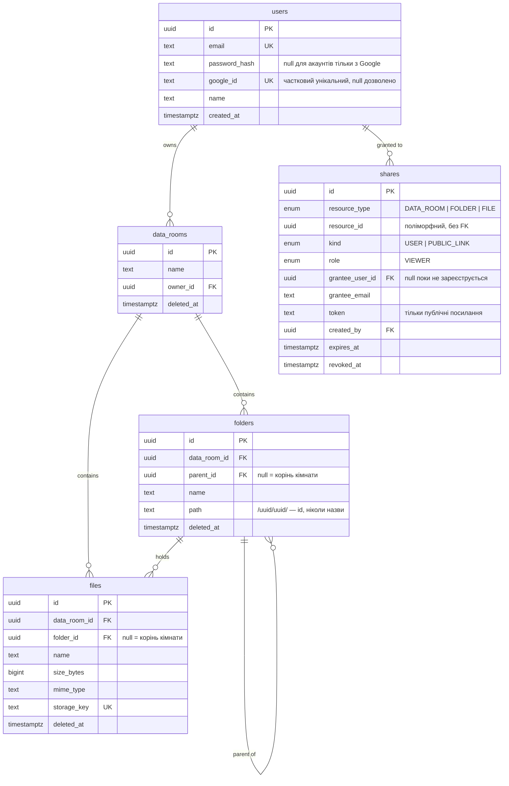

> Українська · [English](README.md)

# Data Room API

Бекенд для віртуальної кімнати даних: вкладені папки, завантаження файлів напряму у сховище та
шаринг кімнати, папки або окремого файлу на читання — публічним посиланням або конкретному
користувачу.

**Стек:** NestJS 11 · TypeScript · PostgreSQL 17 (Supabase) · TypeORM 0.3 (тільки міграції,
`synchronize: false`) · Supabase Storage · JWT + Google OAuth 2.0

---

## Задеплоєне

| | URL |
|---|---|
| API | `<railway-url>` |
| Swagger | `<railway-url>/api/docs` |
| Фронтенд | `<vercel-url>` |
| Health | `<railway-url>/health` |

---

## Запуск

Потрібні Node 20+, база PostgreSQL і бакет Supabase Storage.

```bash
git clone git@github.com:Zetonen/foldersBE.git
cd foldersBE
npm ci
cp .env.example .env      # заповнити, див. нижче
npm run migration:run     # створює всю схему
npm run seed              # опційно: демо-користувачі, дерево і шари
npm run start:dev         # http://localhost:3001, документація на /api/docs
```

`.env.example` пояснює кожну змінну прямо в коментарях. Ті, що не мають дефолту:

| Змінна | Пояснення |
|---|---|
| `DATABASE_URL` | Рантайм. Supabase **transaction pooler, порт 6543**. Prepared statements для нього вимкнені. |
| `DIRECT_URL` | Тільки міграції. **Порт 5432** (session mode) — transaction pooler не виконує DDL надійно. |
| `JWT_ACCESS_SECRET`, `JWT_REFRESH_SECRET` | Два незалежні секрети, мінімум 32 символи кожен. |
| `SUPABASE_URL`, `SUPABASE_SERVICE_ROLE_KEY`, `SUPABASE_STORAGE_BUCKET` | Бакет має бути **приватним**. Ключ service_role — тільки для бекенду. |
| `FRONTEND_URL` | Origin для CORS. Можна список через кому; перший елемент також є базою для Google-редіректу. |
| `GOOGLE_CLIENT_ID`, `GOOGLE_CLIENT_SECRET` | Опційні. Якщо порожні, `GET /auth/google` віддає **503**, решта API працює як звичайно. |

Застосунок валідує все оточення на старті (`src/config/env.validation.ts`) і відмовляється
підніматись із поганим конфігом, замість того щоб впасти на першому ж запиті.

### Скрипти

```bash
npm run start:dev        # watch-режим
npm run build            # nest build
npm test                 # 35 юніт-тестів
npm run lint             # eslint з перевіркою типів
npm run format           # prettier
npm run migration:run    # застосувати міграції
npm run migration:revert # відкотити останню
npm run seed             # демо-дані: 2 користувачі, невелике дерево, 3 види шарів
npm run seed:test-room   # кімната на 1000 файлів для перевірки пагінації
```

`npm run seed` друкує створені креденшели. Обидва сіди ідемпотентні — повторний запуск нічого не
додає і нічого не руйнує.

---

## Модель даних



П'ять таблиць, усі клієнти в одних і тих самих — ізоляція йде колонкою `data_room_id`, і жоден
запит до `folders` чи `files` не виконується без неї.

---

## Архітектурні рішення

### Дерево — це adjacency list *і* materialized path одночасно

`folders.parent_id` — джерело істини. `folders.path` — денормалізований рядок виду `/uuid1/uuid2/`,
який завжди містить id і ніколи назви, тому перейменування папки не зачіпає жодного path.

Тримати обидва варто саме тому, що це робить дорогі операції дешевими:

| Операція | З path | Тільки з parent_id |
|---|---|---|
| Усе піддерево | `path LIKE '/a/b/%'`, один index scan | рекурсивний CTE |
| Видалити гілку | один `UPDATE … WHERE path LIKE` | рекурсивний CTE, потім update |
| Хлібні крихти | розбити рядок, один `WHERE id = ANY(...)` | по запиту на кожен рівень |
| Список предків для перевірки прав | розбити рядок, нуль запитів | рекурсивний CTE на кожен запит |

`idx_folders_path_pattern` створений із `text_pattern_ops` — без нього предикат `LIKE 'prefix%'`
не може скористатись btree-індексом при неC-локалі.

Переміщення папки переписує path усього піддерева одним `UPDATE` із заміною префікса, попередньо
відхиливши цикли (`isDescendantOrSelf`) і перевіривши ліміт вкладеності у 20 рівнів для
**найглибшого** вузла, що переїжджає, а не тільки для самої папки.

У файлів path немає — тільки `folder_id`. Шлях файлу — це шлях його папки, а дублювати його
означало б переписувати кожен рядок `files` при кожному переміщенні папки.

### Перевірка прав живе рівно в одному місці

Шар зберігається **тільки на тому вузлі, де його надали**, і ніколи не копіюється вниз. Резолвінг
натомість іде вгору: `path` розбирається на масив id предків, і один запит шукає шари по будь-якому
з них.

```
ResourceAccessGuard  →  AccessResolverService  →  AccessRepository
   (роути, ролі)          (власник? шари? роль)      (SQL)
```

Правила, які тримає резолвер:

- Власник ресурсу перемагає завжди, без жодного запиту до `shares`.
- Ефективна роль — `MAX(role)` серед усіх шарів, знайдених на ланцюжку предків.
- Публічний токен дає доступ **лише до свого вузла і його піддерева**. Guard перерезолвлює токен
  проти предків запитаного вузла, тому сусідня папка віддає 404. Без цієї перевірки токен був би
  готовим IDOR.
- Хлібні крихти обрізаються на корені шару (`boundaryId`), тому отримувач ніколи не дізнається
  назв папок вище за те, що йому надали.

У контролерах немає жодного `if` про права. Ендпоінти лише декларують намір:

```ts
@ResourceTarget({ type: ShareResourceType.Folder, from: 'params', key: 'id' })
@RequireRole(Role.Owner)
```

**404 проти 403:** 404, коли доступу немає взагалі — атакувальник не повинен мати змоги промацати,
які id існують. 403 — тільки коли доступ є, але роль замала. 409 — конфлікт імені. Очікувані
ситуації ніколи не дають 500.

### Файл ніколи не проходить через Node

Завантаження — рукостискання у три кроки:

1. `POST /files/upload-url` — перевіряє папку, розмір і MIME-тип, розв'язує фінальне ім'я проти
   наявних сусідів, повертає підписаний URL і `storageKey`.
2. Браузер робить `PUT` байтів напряму в Supabase Storage.
3. `POST /files/confirm` — переконується, що об'єкт дійсно існує і його розмір збігається з
   обіцяним, і тільки тоді вставляє рядок.

API-сервер не буферизує файл, тому завантаження на 100 МБ коштує йому двох маленьких запитів, а
прогрес — нативна справа браузера. Віддача симетрична: підписаний URL із TTL 15 хвилин, генерується
на вимогу і ніде не зберігається.

Крок 2 може впасти після того, як крок 1 уже видав ключ. Це залишає у бакеті об'єкт без посилання,
але ніколи не залишає рядок-привид: база дізнається про файл лише коли байти перевірено на місці.

### Конфлікти імен розв'язуються, а не падають

Завантаження `audit.pdf` у папку, де такий уже є, дає `audit (1).pdf`, наступний — `audit (2).pdf`.
Суфікс ставиться перед розширенням, і пошук вільного номера ігнорує суфікси з іншим розширенням.
Папки користуються тим самим хелпером із вимкненим розбором розширення.

Одна реалізація (`NameConflictService`) спільна для upload, rename і move, тому вони не можуть
розійтись. База підстраховує інваріант частковими унікальними індексами
`(folder_id, name) WHERE deleted_at IS NULL`; гонка, що проскочила повз перевірку, вилазить як 409,
а не як дублікат.

Postgres не вважає `NULL`-и рівними в унікальному індексі, тому елементи в корені кімнати
(`folder_id IS NULL`) потребують власних часткових індексів — без `uq_files_room_root_name` у корені
можна було б створити два однойменні файли.

### Усе видаляється м'яко

`deleted_at` у кімнат, папок і файлів; кожне читання фільтрує `deleted_at IS NULL`. Видалення папки
проставляє мітку всьому піддереву двома `UPDATE` через `path LIKE`.

Перед діалогом підтвердження фронт викликає `GET /folders/:id/stats`, який віддає і скільки лежить
*безпосередньо* в папці, і скільки в усій гілці — щоб попередження могло сказати «80 файлів у
2 папках, 1.2 МБ буде видалено», а не число, яке користувач не може звірити.

Якщо отримувач у цей момент дивиться на папку, його наступний запит віддасть 404 через той самий
шлях у коді, що й будь-який відсутній ресурс — жодних окремих гілок.

### Автентифікація

Access-токен (15 хв) у тілі відповіді, refresh-токен (7 днів) у `httpOnly` cookie з областю
`/auth`. Обидва ротуються при оновленні. `/auth/login` і `/auth/register` обмежені за частотою на IP.

Google-вхід використовує authorization-code flow зі сторінкою колбеку **на фронті** — бекенд ніколи
не редіректить браузер, він лише формує URL згоди і згодом обмінює код. Захист від CSRF — підписаний
JWT `state` на 10 хвилин із випадковим nonce, що лишає сервер stateless. Отриманий `id_token`
валідується (`iss`, `aud`, `exp`, `email_verified`).

Звʼязування акаунтів іде спершу за id Google-акаунта, потім за **підтвердженим** email.
Непідтверджений email відхиляється — інакше будь-хто, хто створить Google-акаунт на чужу
непідтверджену адресу, забрав би собі чужу кімнату даних.

---

## API

32 операції, усі описані у Swagger на `/api/docs`.

| Метод | Шлях | Примітки |
|---|---|---|
| `POST` | `/auth/register`, `/auth/login` | обмеження частоти |
| `GET` | `/auth/google` | URL згоди; 503 якщо не налаштовано |
| `POST` | `/auth/google/callback` | code + state → токени |
| `POST` | `/auth/refresh`, `/auth/logout` | refresh-cookie |
| `GET` | `/auth/me` | |
| `POST`/`GET`/`PATCH`/`DELETE` | `/data-rooms`, `/data-rooms/:id` | |
| `GET` | `/data-rooms/:id/root` | листинг кореня, з пагінацією |
| `POST` | `/folders` | |
| `GET` | `/folders/:id/children` | з пагінацією |
| `GET` | `/folders/:id/stats` | прямі + піддеревні лічильники |
| `PATCH`/`POST`/`DELETE` | `/folders/:id`, `/folders/:id/move`, `/folders/:id` | перейменувати, перемістити, видалити гілку |
| `POST` | `/files/upload-url`, `/files/confirm` | |
| `GET` | `/files/:id`, `/files/:id/download-url` | |
| `PATCH`/`POST`/`DELETE` | `/files/:id`, `/files/:id/move`, `/files/:id` | |
| `POST`/`GET`/`DELETE` | `/shares`, `/shares?resourceType=…`, `/shares/:id` | створити, перелічити, відкликати |
| `GET` | `/shared-with-me` | що інші пошерили мені |
| `GET` | `/share/:token`, `/share/:token/folders/:folderId` | публічне посилання, без авторизації |

Листинги пагінуються keyset-ом: `?limit=` (за замовчуванням 50, максимум 100 — вище цього **400**,
ніколи не мовчазне зрізання) і непрозорий `?cursor=`. `nextCursor: null` означає останню сторінку.
Кожен листинг також віддає `totalItems` — кількість прямих нащадків, щоб клієнт міг показати
«50 із 137».

---

## Як воно масштабується

### Загальний розмір і кількість елементів папки разом із піддеревом

Один запит, без рекурсії (`FoldersService.stats`):

```sql
WITH subtree AS (
  SELECT id FROM folders
  WHERE data_room_id = $1 AND path LIKE '/a/b/%' AND deleted_at IS NULL   -- idx_folders_path_pattern
), file_totals AS (
  SELECT count(*) AS file_count, coalesce(sum(size_bytes), 0) AS total_size
  FROM files
  WHERE data_room_id = $1 AND deleted_at IS NULL AND folder_id IN (SELECT id FROM subtree)
)
SELECT (SELECT count(*) FROM subtree) - 1 AS folder_count, ...
```

Materialized path перетворює «піддерево» на один діапазонний скан індексу, а агрегат по файлах —
один прохід по знайдених рядках. Цей самий виклик віддає ще `directFolderCount` / `directFileCount`
двома індексованими підрахунками по одному рівню, бо панелі деталей потрібно «1 елемент», а
попередженню про видалення — «80 файлів».

Заміряно на сід-кімнаті з 1000 файлів: 162 мс на піддерево з 500 файлів.

Це O(піддерева). До десятків тисяч усе гаразд, і це неправильна форма в той момент, коли хтось
захоче розмір кімнати на мільйон файлів при кожній навігації. Виправлення не змінює схему: тримати
rollup-рядки `(folder_id, file_count, total_size)`, які підтримуються тригерами або періодичною
задачею, і читати один рядок замість агрегації. Тут я цього не робив — на цьому обсязі воно нічого
не дає, а платити довелось би записом при кожному завантаженні файлу.

### Одна кімната на 100 000 файлів

**Листинг** завжди по папці, ніколи по кімнаті, тож робочий набір — діти однієї папки, хоч би яка
велика була кімната. `idx_files_room_folder_name (data_room_id, folder_id, name)` і
`idx_folders_room_parent (data_room_id, parent_id, name) WHERE deleted_at IS NULL` обслуговують саме
цей патерн доступу, а другий ще й сортування.

**Пагінація keyset, а не OFFSET.** Курсор — base64-пара `(name, id)`, а запит просить
`(name, id) > ($cursor_name, $cursor_id) ORDER BY name, id LIMIT n+1`. Сторінка 2000 коштує стільки
ж, скільки перша, тоді як `OFFSET 100000` змусив би базу пройти і викинути 100 тисяч рядків. Вибірка
`n+1` — це те, як `nextCursor` дізнається про існування наступної сторінки без окремого COUNT.

Заміряно: 500 файлів за 5 сторінок по 100 — 1.5 с наскрізно через публічний інтернет до Supabase.

**`limit` обмежений сотнею** на сервері. Клієнт не може попросити всю кімнату одним запитом.

**Що насправді зламається першим на 100k**, чесно: `GET /folders/:id/stats` на корені кімнати, який
за визначенням чіпає кожен рядок — саме для нього і потрібна rollup-таблиця вище. Решта шляху
листингу обмежена розміром сторінки.

**Пошук** (не реалізований) потребував би `pg_trgm` із GIN-індексом на `files.name`, обмеженим по
`data_room_id`; `ILIKE '%term%'` без нього — послідовний скан.

### Ролі на користувача (viewer/editor) без перебудови моделі

Модель це вже передбачає — саме тому `shares.role` сьогодні є нативним enum з одним значенням, а не
булевим прапорцем:

1. `ALTER TYPE share_role_enum ADD VALUE 'EDITOR'` — один рядок міграції.
2. Додати `[Role.Editor]: 50` до мапи `RANK` у `role.enum.ts`, між Viewer (10) і Owner (100).
3. Додати один запис у `SHARE_ROLE_TO_ROLE`.

Більше не змінюється нічого:

- `maxRole()` уже рахує найсильнішу роль по ланцюжку предків, тож користувач із VIEWER на кімнаті
  та EDITOR на папці всередині отримає EDITOR там і VIEWER деінде — безкоштовно.
- `satisfies(actual, required)` уже порівнює ранги, тож кожному ендпоінту, який зараз декларує
  `@RequireRole(Role.Owner)` для мутацій, достатньо змінити декоратор на `Role.Editor` — логіка
  хендлерів не рухається.
- Різниця між ролями виражена один раз, у таблиці рангів, а не розмазана по guard-ах.

Єдине, що справді потребує нового коду, — *хто кому може надавати доступ*: сьогодні шерити може лише
власник. Це питання політики («чи може редактор запрошувати інших?»), а не моделювання.

---

## Тести

35 юніт-тестів (`npm test`) на тих ділянках, де помилка тиха, а не гучна:

- `access-resolver.service.spec.ts` — обхід для власника, підвищення ролі по ланцюжку предків,
  обрізання межі та крихт, токен, обмежений своїм піддеревом, анонім без токена.
- `google-oauth.service.spec.ts` — round-trip для `state`, підроблений state, state із чужим
  секретом, невірний `aud`, невірний `iss`, протермінований токен, непідтверджений email,
  недоступний Google, фолбек redirect-uri.
- `auth.service.spec.ts` — створення акаунта, повторне використання, звʼязування з Google, перевірка
  `state` **до** витрачання одноразового коду, відмова від входу паролем для Google-акаунта.

Поведінку ендпоінтів перевірено на задеплоєній базі із сід-кімнатою на 1000 файлів: межі пагінації,
стеля `limit`, прямі проти піддеревних лічильників, і всі шляхи доступу для отримувача шару на файл
проти отримувача шару на папку.

---

## Де використано AI

Основним інструментом був Claude Code (Opus).

**Що AI написав переважно сам:** бойлерплейт і механічний обсяг — класи DTO з декораторами
валідації, анотації Swagger, SQL міграцій за заданою мною схемою, скрипти сідів, юніт-тести після
того, як я описав, які випадки покрити, і перший драфт цього README.

**Що вирішував я, а AI виконував:** усі архітектурні рішення з розділу «Архітектурні рішення».
Materialized path поруч з adjacency list, права тільки на вузлі надання з резолвінгом угору, 404
замість 403 для відсутнього доступу, завантаження напряму у сховище, keyset замість offset, м'яке
видалення скрізь. Я записав це як правила проєкту у `CLAUDE.md` ще до появи коду, і саме в цих
рамках AI працював.

**Що AI зробив неправильно і я зловив:**

- Він виводив Google redirect URI з усього списку `FRONTEND_URL` через кому, що давало безглуздий
  URL щойно зʼявився б другий CORS-origin. Знайшов, читаючи код під час відповіді на зовсім інше
  питання про деплой; полагодив і додав тест на випадок зі списком.
- Додавання «хто це мені пошерив» у відповідь про файл злило **email власника** анонімним
  відвідувачам публічних посилань. Виявив, протестувавши ендпоінт анонімно, а не повіривши дифу.
  Тепер email є лише в `/shared-with-me`, який без JWT недоступний.
- Згенерований хелпер містив `role === Viewer ? Viewer : Viewer` — тернарник з ідентичними гілками,
  що маскував факт існування єдиної ролі. Замінено явною мапою — і саме це зробило відповідь
  «додати EDITOR — це три рядки» вище справді правдивою.
- Згенерований код очистки сіду видалив би назавжди кімнату даних, у якій уже лежали справжні
  файли. Виявив, перевіривши ціль перед запуском видалення.

**Чого я не делегував:** рев'ю кожного рядка перед комітом, модель безпеки і рішення про те, що
лишити за бортом.

Підсумок: AI зробив написання приблизно втричі швидшим і не ухвалив жодного з рішень, про які
цей документ.

---

## Відомі обмеження

Свідомо обмежено в часі;

- **Ролі лише VIEWER.** Шаринг дає доступ на читання. Enum, таблиця рангів і guard-и вже вміють
  ролі (див. вище) — бракує UI та політики, а не схеми.
- **Обʼєкт у сховищі видаляється одразу при мʼякому видаленні файлу.** Рядок відновлюваний, байти —
  ні. Для користувача послідовно, але суперечить «мʼяке видалення скрізь»: правильне рішення —
  garbage-collection по `deleted_at < now() - interval '30 days'`, щоб рядок і байти йшли в ногу і
  справжнє відновлення стало можливим. Видалення *папки* обʼєкти вже не чіпає.
- **Немає пошуку і версіонування файлів** — обидва в брифі позначені як необовʼязкові додатки.
- **Тільки PDF, до 100 МБ**, перевіряється і на `/files/upload-url`, і на `/files/confirm`.
  Розширюється через `FILE_ALLOWED_MIME_TYPES`.
- **Токени шарів не ротуються** — посилання можна відкликати, але не перевипустити на місці.
- **Немає структурованого логування запитів і трасування.** Для одного інстансу нормально, але це
  перше, що я додав би перед другим.
